As an engineer, I believe it is one of my core responsibilities to inspire the next generation of young scientists and engineers through low-pressure fun activities that encourage STEM literacy and problem solving. I have become especially interested in learning how to support and advocate for students from underrepresented groups, especially those from schools with limited access to in-class science curricula and to after-school STEM clubs. 

## K-12 School Outreach
I enjoy visiting classrooms and school science events to give demos, serve as a guest speaker, and judge student projects. 

### North Carolina Science Festival IMPACTS Program
Selected for 2019-2020 Piedmont Triad cohort of the Inspiring Meaningful Programs and Communication Through Science ([IMPACTS](https://www.ncsciencefestival.org/IMPACTS)) Program, a statewide science communication training and outreach initiative based on the NSF Portal to the Public curriculum and funded by the North Carolina GlaxoSmithKline Foundation. As part of my training, I am designing and implementing K-12 STEM outreach events for classroom visits, community events, and science festivals across North Carolina. 
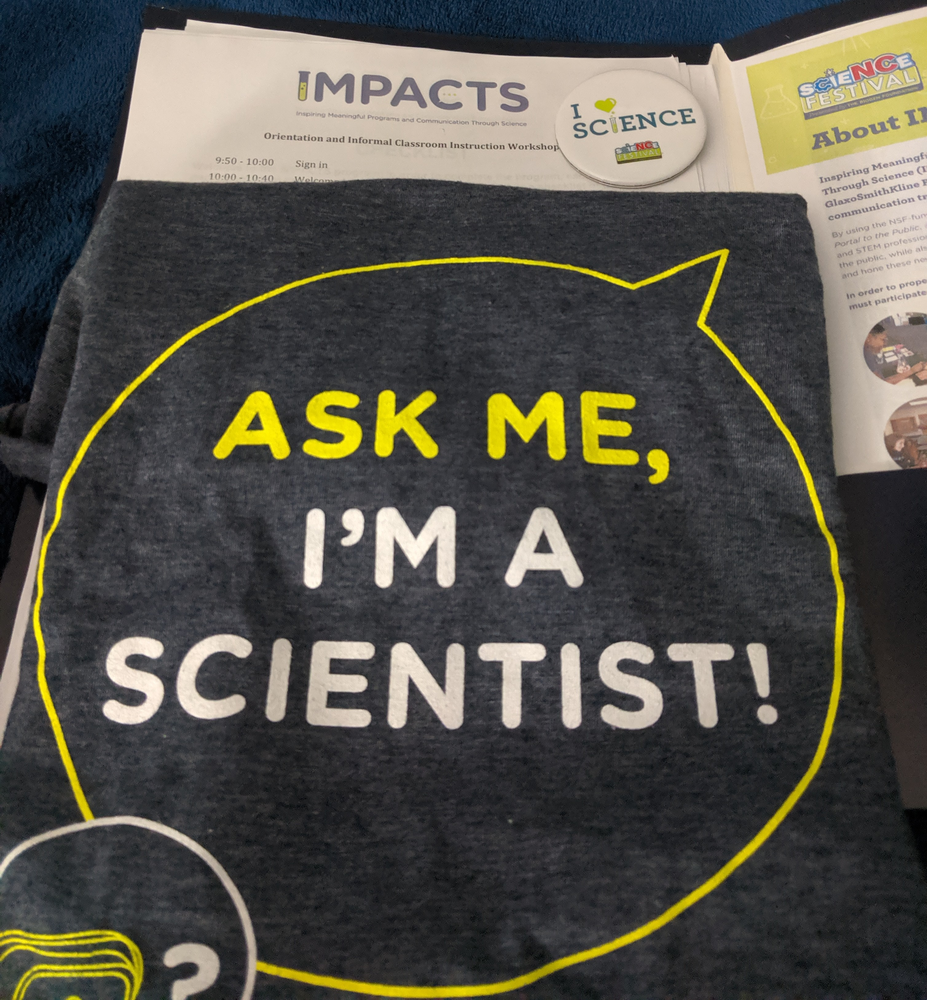

#### IMPACTS - Novozymes SciMatch Classroom Visit
In December 2019, I visited Ms. Opal Baker's 6th grade science classes at MLK Junior Middle School in Charlotte, NC. I taught her four classes for a day, showing the students how I became a engineer, demoing some of our lab's research in computational modeling of astronaut injury, and leading a hands-on activity that shows how bone loss occurs in astronauts during spaceflight. 
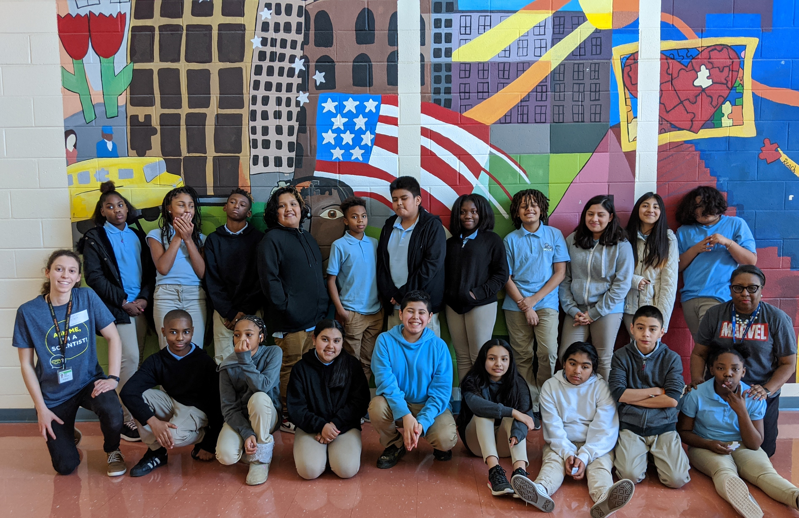

### Petree Elementary School STEM Night
Below is a picture from 2019 Petree Elementary STEM Night, where I brought 3D printed bones to teach the kids about the structure of bones and how they can be strong but also lightweight. 

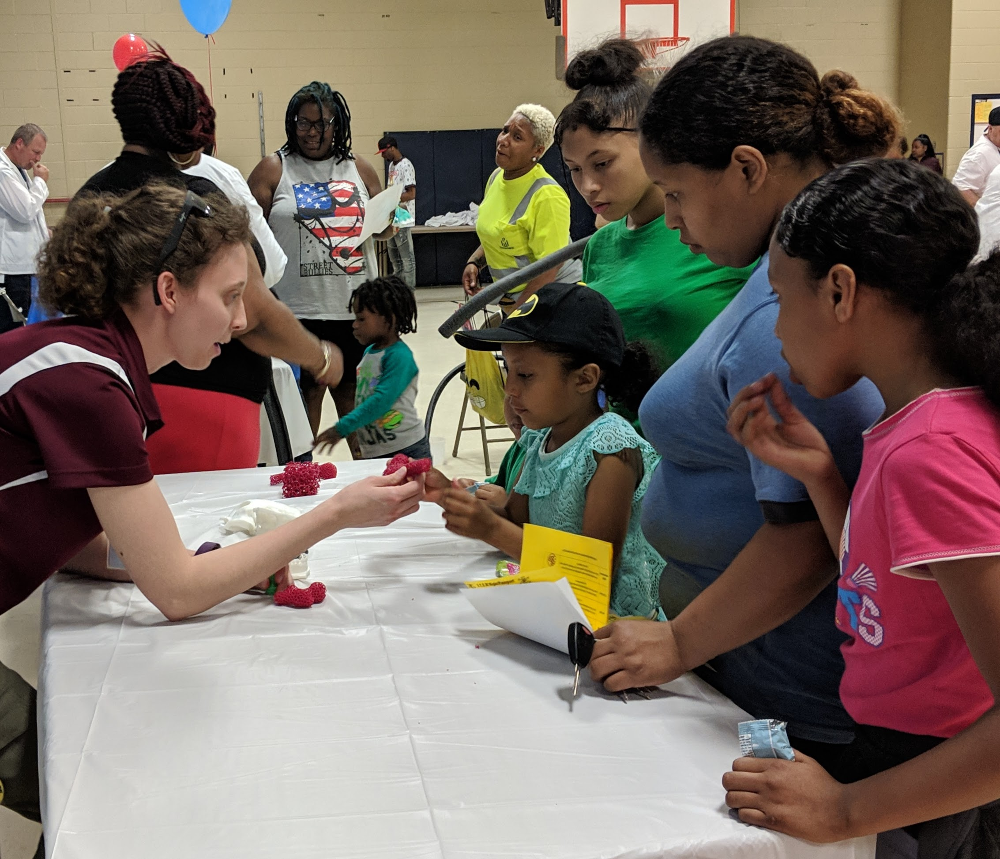

### Girls and Boys Club Science Hour
In July of 2019, I designed and ran an hour long introduction to Biomedical Engineering for the Winston-Salem Boys & Girls Club in collaboration with our university's scientific communication group, [Wake Up To Science](https://twitter.com/WakeUptoScience). We guided the kids through designing and building a functional biomechanical arm in order to show them how engineering can be used to make devices, like prosthetics, that help individuals in need. Guest speaker, [Rayonna Gordon](https://www.linkedin.com/in/rayonna-gordon/) (pictured below) also led an active discussion with them on the applicability of biomedical engineering to helping low-resource communities worldwide.

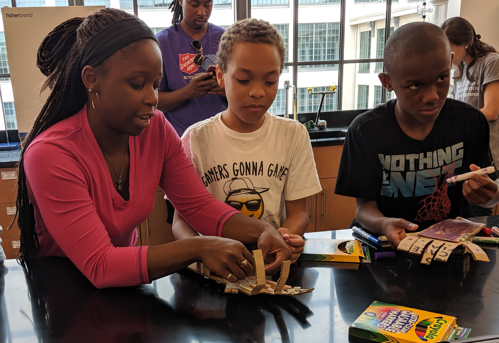

### Biomedical Engineering with MedCaT Students
In July 2019, I organized and led an afternoon introduction to research in Biomedical Engineering for American Indian and Appalachian high school students and teachers in the [Wake Forest Medical Careers and Technology (MedCaT) Pipeline](https://school.wakehealth.edu/Research/Institutes-and-Centers/Clinical-and-Translational-Science-Institute/Maya-Angelou-Center-for-Health-Equity/Pipeline-Programming/Medical-Careers-and-Technology-Pipeline) in order to expose them to pursue health and biomedical science careers. Four graduate students talked about their paths to engineering careers and discussed their research in the biomechanics of baseball pitching, tissue engineering, astronaut health, and medical device design. Afterwards, the group went on an extended tour of our additive manufacturing facilities and surgical robotics lab. 

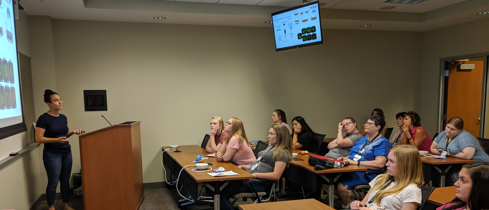

### Wake Forest Biosciences & Engineering Summer Immersion Program
Around 100 high school students from across the country visited the department of Biomedical Engineering across two afternoons in July 2019 during the [Wake Forest Summer Immersion Program](https://immersion.summer.wfu.edu/institutes/bioscience-engineering-institute/). I and my graduate advisor, Dr. Ashley Weaver, coordinated each day's events, including an interactive overview of the biomedical engineering field, TED-style talks from seven faculty researchers, and a series of hands-on demonstrations in five different laboratories in Biotech Place. This annual program aims to introduce students to diverse career pathways in the basic sciences to engineering by exposing them to cutting edge research projects and leading researchers in the field. During the research overview talks and tours, faculty members and graduate students showed the students various projects in nanotechnology, injury biomechanics, bioinformatics, and trauma research – with the ultimate goal of showing them how the research fundamentally helps improve human health and safety for millions of people across the world. 

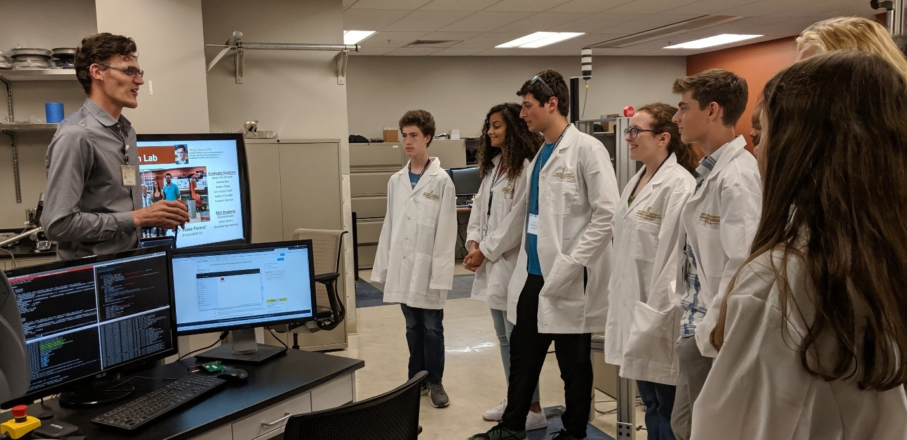

### Letters to a Pre-Scientist Pen pal
Trained pen pal for national non-profit [Letters to a Pre-Scientist](https://www.prescientist.org/) program that seeks to demystify science careers by connecting students and classrooms in low-income communities with real scientists and engineers through regular letter exchanges. My current student is located in Santa Maria, California. 
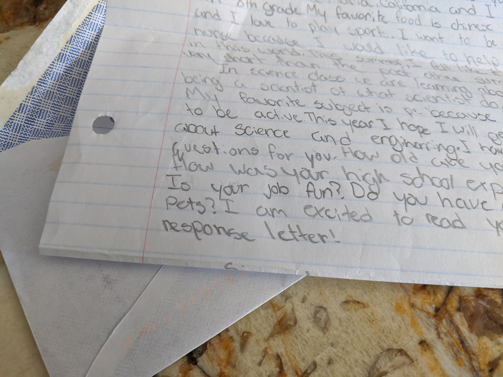

## FIRST Robotics
In high school, my experience on a FIRST robotics team (Team 1717 D'penguineers) as a mechanical designer was instrumental in my decision to pursue engineering as a career. Over the years, I have used the technical skillset I've developed to mentor several FIRST Lego League teams, serve as an instructor for robotics summer camps, and also volunteer for several local and regional FIRST competitions. 

### Winston-Salem Robot Run
In October 2019, I served as head judge at the annual Winston-Salem Robot Run, which brings together FRIST Lego League teams from over 10 local middle schools to compete with their robots. In 2017 and 2018, I was a technical design judge and assistant head judge. 

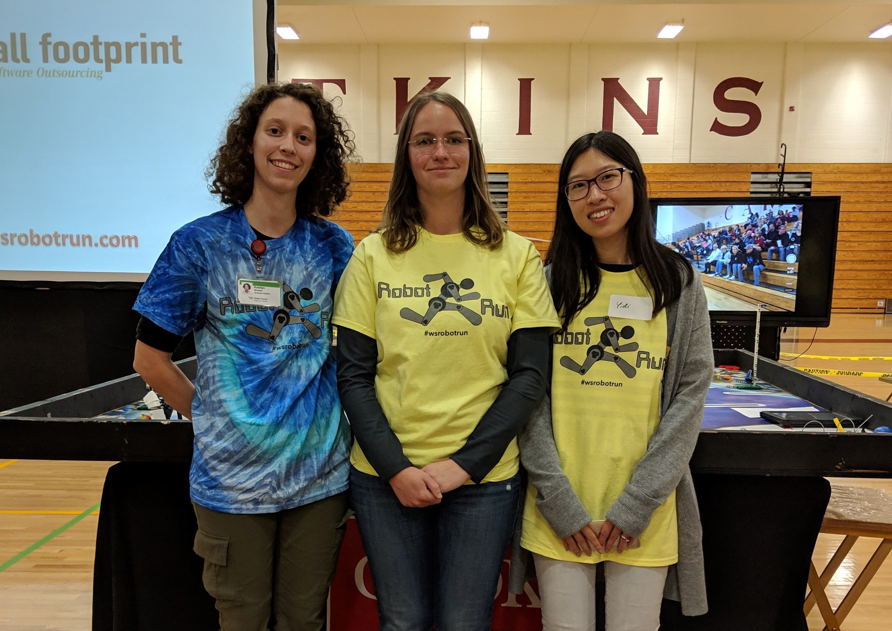

## Women in STEM
By the time girls reach high school, they've generally already formed an idea of whether they'd fit into a STEM career. It's my goal to expose girls to the opportunities they have in STEM by connecting them to successful women in all career stages. As a graduate of one of the top engineering universities in the world (Go Bears!) and now a engineering PhD candidate, I'm passionate about serving as a role model for young girls. 

### Regan High School Women in BME Day
In May 2019, I alongside my fellow PhD student [Andrea Mazzocchi](https://twitter.com/A_Mazzocchi) organized an afternoon visit to the Biomedical Engineering Department at the Wake Forest School of Medicine. We gave the high school students an overview of the career paths in biomedical engineering, hosted a graduate student panel, and led them on group tours of the research labs. 

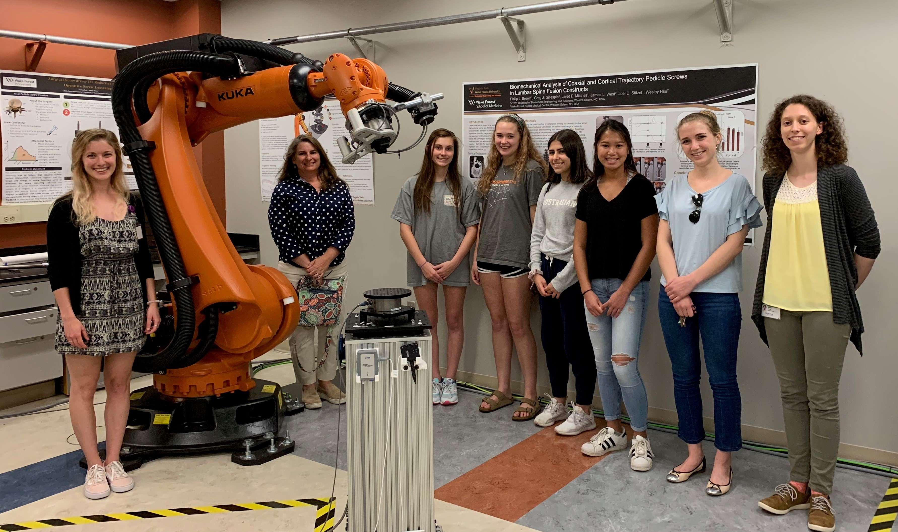
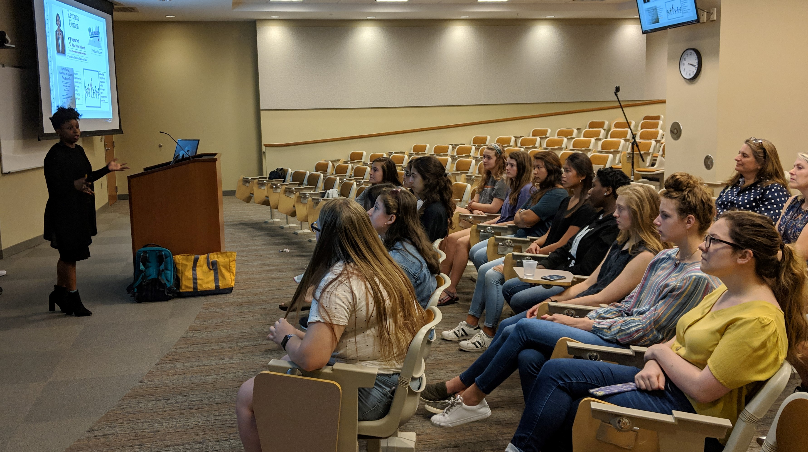

### Girls Who Code
I am a co-facilitator of the Girls Who Code club at the Malloy/Jordan East Winston Heritage Center.  I have experience both developing and teaching project-based curricula to teach elementary and middle school aged girls the fundamentals of computer science and coding syntax. Below is a picture of one of our facilitators, [Madison](https://www.linkedin.com/in/l-madison-kirk-7556b0148/), teaching the girls about loops! 

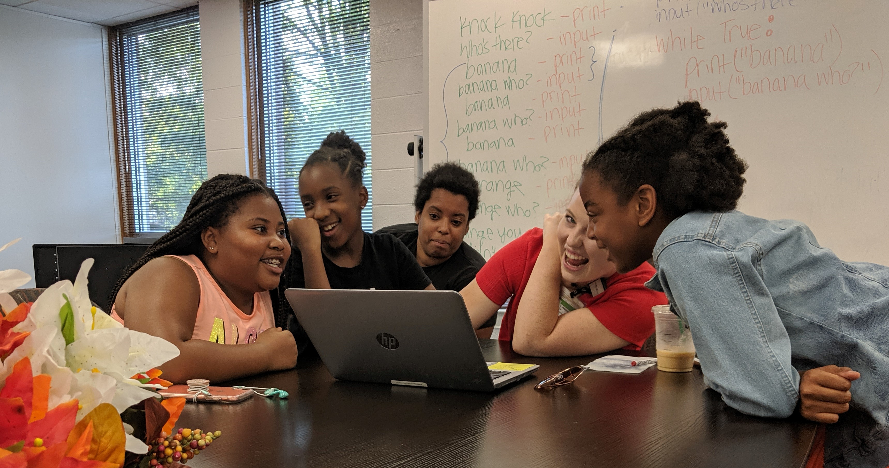

### Perry Initiative
The [Perry Initiative](https://perryinitiative.org) is an phenomenal program that travels around the country to run hands-on outreach programs for women students in high school, college, and medical school. 

In 2018 and 2019, I assisted as an on-site volunteer at the Wake Forest School of Medicine location along with several other students and faculty in Biomedical Engineering and Orthopaedic Surgery. This one-day workshop to introduces young women in high school to fracture fixation techniques and power tools and encourages them to pursue careers in engineering and orthopaedic medicine. 

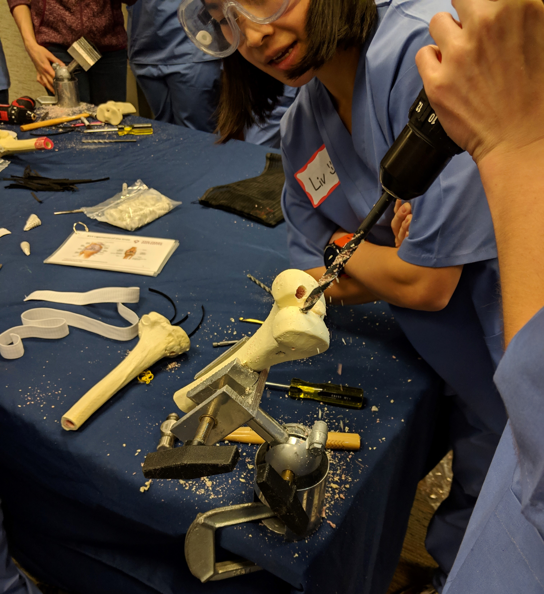
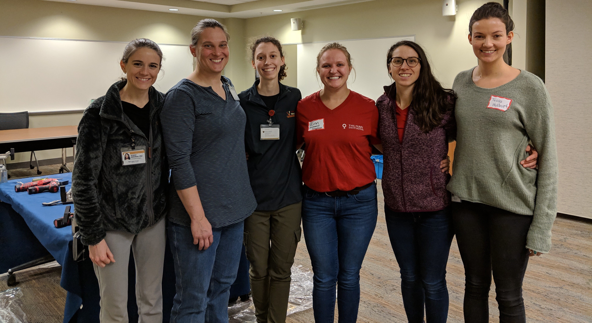

## Science Outreach for all ages in the community

### The Science of Winston-Salem (TSOWS)
Partner and student representative for a new non-profit initiative that uses arts, pop culture, and storytelling to organize and promote opportunities for informal STEM learning among all members of the Winston-Salem community. Image below is from the [TSOWS website](https://www.thescienceofwinstonsalem.org/).

#### TSOWS - Pint of Science Festival 
Helped support the inaugural Winston-Salem Pint of Science Festival, which hosted over 130 community members at three downtown breweries for a series of engaging and accessible science talks presented by local researchers.
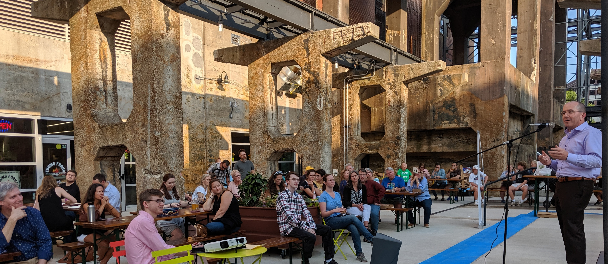