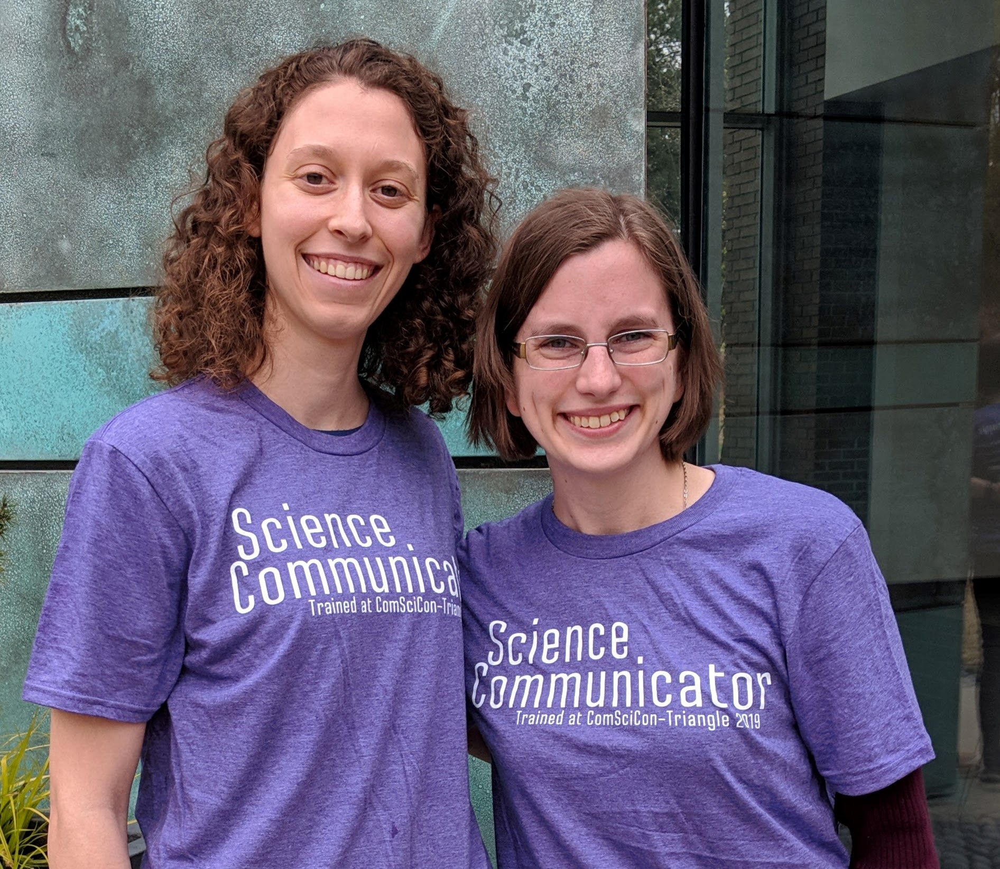
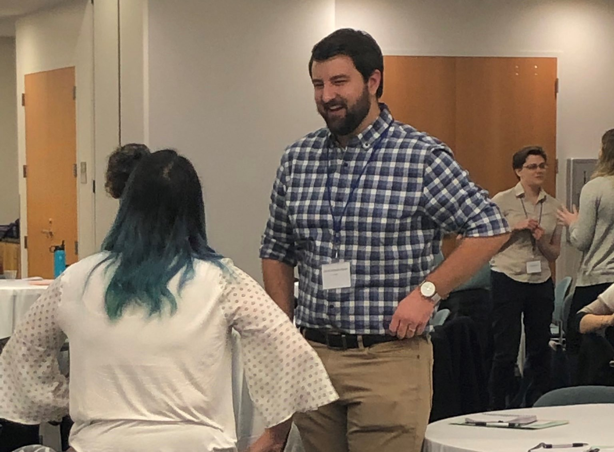
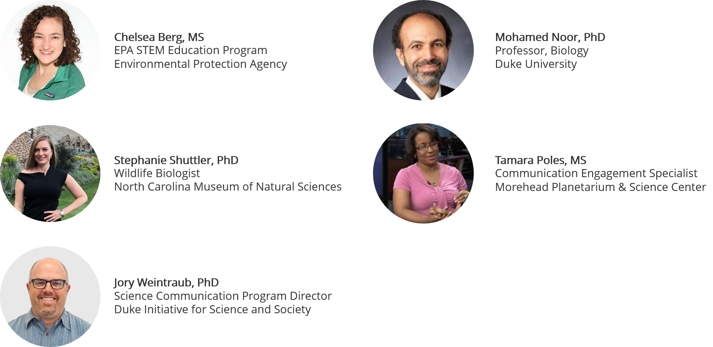
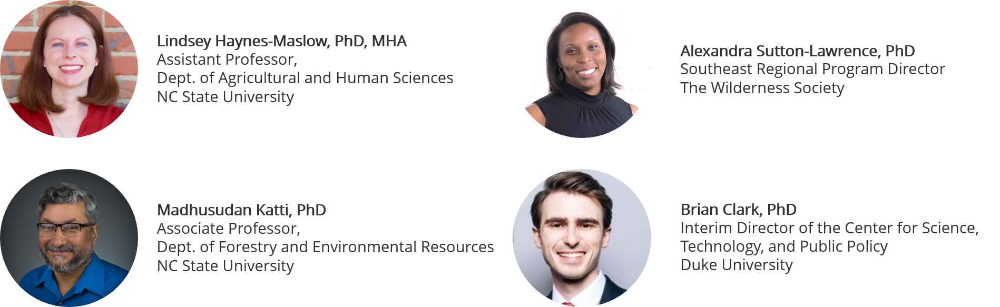
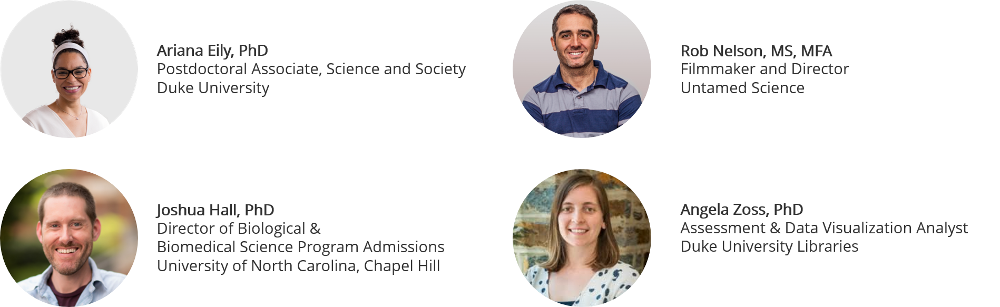
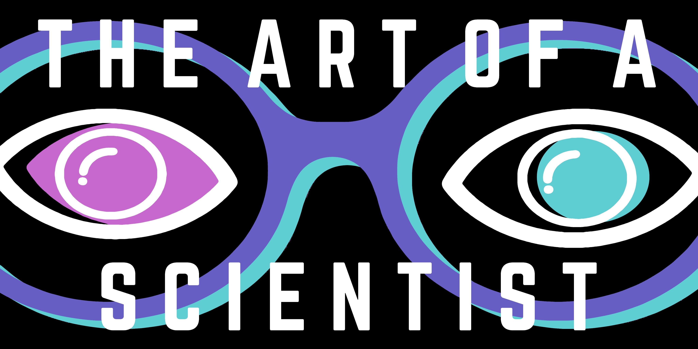
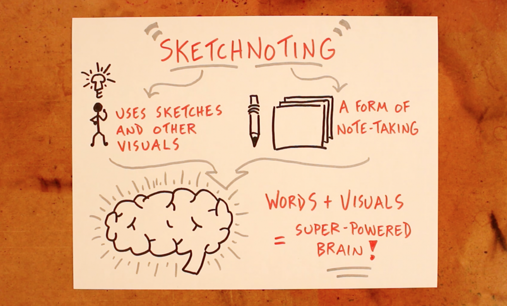

Earlier in 2019, I applied and was selected to attend this year's ComSciCon Triangle workshop series! The ComSciCon-Triangle workshops are designed to empower STEM graduate students in North Carolina to communicate the concepts in their field and beyond to diverse audiences. This unique professional development experience was a fantastic opportunity for me to meet science communication leaders from across the region, learn from and interact with a  remarkable group of invited experts, and produce an original work communicating scholarly research to a public audience. I really enjoyed the experience and highly recommend this workshop to other NC graduate students! If you want to learn more about this awesome opportunity and apply, check out the [ComSciCon website](https://comscicon.com)! To learn more about my time at ComSciCon Triangle, keep reading! 

Image: Wake Forest graduate students, Katelyn Greene and Brooke Widner at ComSciCon Triangle. 

# Highlights of attending ComSciCon Triangle
1. **New friends and connections.** It was great meeting graduate students and professionals from all over North Carolina and learning about their research and passion for science communication ("SciComm"). Being from the NC Triad, this was an especially beneficial and eye-opening experience, because we often don't have access to all the great events in the NC Triangle area! Thank you so much to the ComSciCon Triangle organizers for extending the reach of the workshop and allowing students from Wake Forest University and UNC Greensboro to attend! 
2. **Access to SciComm Resources.** Take lots of notes at the workshop and take advantage of the writing resources the organizers provide. The insight gained from the panelists and expert review lunch gave me the resources I needed to start contributing meaningful content to various SciComm outlets online. 
3. **Confidence in public speaking.** As part of the workshop, we participated in several opportunities to get up and practice talking in front of our peers, including science improv, 60-second research "pop talks", and interactions with panelists. I always overthink public talks, so these activities provides informal opportunities to practice speaking in front of a highly-supportive audience. 
4. **Writing and publishing a SciComm piece.** We all produce a written piece and receive feedback from other participants and expert professionals in science communication. Check out my [article](https://katelyngreene.com/post/2019/nasa_human_research/). The workshop also provides assistance with getting the article pitched and published with one of their partner publishers.
5. **Shared excitement about science communication.** Attending this workshop sparked my interest and enthusiasm for getting involved with science communication as a graduate student and broadened my perspective about potential careers after my degree. Now, I clearly understand and advocate for the value that science communication skills can have on enhancing graduate-level training. 

# Notes from Workshop Day 1 

## Introduction to Science Improv
Jenny Spencer, UNC PhD candidate and improv performer and teacher, guided us through a series of science-themed improv icebreakers. As she puts it, improv is "giving gifts where the currency is information!" The activities were especially awkward at first because many of us were groggy from getting up early and a tad hesitant because of our introverted nature. However, after a few minutes and a few brave volunteers, we all loosened up and by the end of the session, the entire room was full of smiles and laughter.  I highly recommend all scientists [take an improv class](https://blogs.scientificamerican.com/observations/want-to-be-a-better-scientist-take-an-improv-class/); we all could benefit from more active listening, open dialogue, and humor in science. 

Image credit: [ComsciCon Triangle](https://twitter.com/comscicontri/status/1109455972110610437/photo/1)

## SciComm Career Panel

### How can we get involved with SciComm here in NC?
* Volunteer to give a talk at your local museum or zoo
* Attend science cafes
* Attend RTP 180
* Morehead IMPACTS Program

### Advice for communicating with people
* Consider the difference between *Science Translation* and *Translational Science*. The key to science translation is seeking out analogies to help people understand concepts based on what they already know. The goal of translational science is getting people invested in the potential benefits of the science. 
* Talk **with** an audience, not **to** an audience. Find a common thread with your audience to make the science (and the scientist) relatable. 
* Figure out the core values of the audience and frame the talk to match these values. 
* Be aware that you cannot change the audience's culture - you need to meet them wherever they are and foster mutual respect. 
* Develop personal stories that you can adjust and share with different audiences.
* If your presenting to younger audiences, show a picture of yourself at their age. Kids absolutely love this.

### General tips for SciComm in your careers
* Use humor in your resume/CV such as including a talk/article with a funny title. The will prompt the interviewer to ask a question because you sparked their interest. 
* Get to know your organization's office of news or communications.
* If a reporter calls you, tell them you are in a meeting and will call them back. Then call the office of communications and ask for tips before calling the reporter back. 

# Notes from Workshop Day 2

## Science Policy Panel 

### Trust is integral to SciComm, especially in public policy
* Science is fundamentally dedicated to serving people and their communities. 
* You must strive to understand the stakeholders in science policy; trust is built on genuine relationships. 
* Connect to their life experiences.
* Take the time to understand the different between race and ethnic background, and how both of these influence culture. 
* Carefully choose the appropriate communication methods to be most effective. Prioritize in-person contact and be attentive to accents and timing of interactions, especially for agricultural communities. (Is it off-season?)
* Never assume people **can't** understand, assume **you** didn't communicate clearly enough. 

### Steps to building trust in brief communications
1. Be authentic 
2. Come prepared with useful information
3. Understand the background of the person you're talking to
4. Match their tone, but also keep control of the narrative

### Tips to communicate effectively 
* Use non-linear storytelling infused with personal interaction. Tone down your analytical scientist mindset, conversations do not need to be formal presentations. 
* Use youtube/television/podcast because this will allow you to connect with more people.

## SciArt and Multimedia Panel 

### Examples of Multimedia SciComm
1. Photography - See Alex Wild's [insect pictures](https://www.alexanderwild.com/Insects/Stories/Portfolio/).
2. Podcasts - See [Hello PhD](http://hellophd.com/).
3. SciArt Galleries - See Duke [Art of a Scientist](https://www.instagram.com/artofascientist/) Gallery.

Image credit: [Duke Art of a Scientist](https://twitter.com/ArtOfAScientist/status/1193215284905234432/photo/1)

### Experiment with Data Visualization - A mode of scientific storytelling
1. Visual/Graphical abstracts for journals and conferences
2. Learn diagramming techniques to improve your figures and presentations
  * Check out Eric Monson's "Diagramming for Science Workshop"
  * Duke's [Data Visualization Friday Forum](http://vis.duke.edu/FridayForum)
3. Try [Sketchnoting](https://www.verbaltovisual.com/what-is-sketchnoting/) - using iconography, typography, and sketching to create a live interpretation of a talk. 

Image Credit: [VerbaltoVisual](https://www.verbaltovisual.com/what-is-sketchnoting/)
4. Have scientists meet with artists to co-create together and have scientists take art classes!

### General SciComm advice 
* Dedicate time to learn and implement best practices for visual design. 
* Do external activities outside of grad school to elevate yourself, practice communication, and deepen your personal perspective. 
* Beware of the trend of content moving toward **_sensationalism_**. People are attracted to this content (hence the explosion of reality TV shows and click bait titles) but it doesn't necessarily enrich their experience. 

### How can we advocate for SciComm training in our graduate education?
1. Read the National Academies [report on graduate STEM education](https://sites.nationalacademies.org/PGA/bhew/GradEd/index.htm) and the importance of scientific communication. Use this data to justify the need for training to your advisor, department, or graduate program.  
2. UNC is collecting data on the importance of science communication and professional development on graduate outcomes. Watch for upcoming paper.
3. Build advocacy among faculty to have workshops and courses students can get credit for. 
4. Weave SciComm into your dissertation or get a committee member that advocates for your career development. 