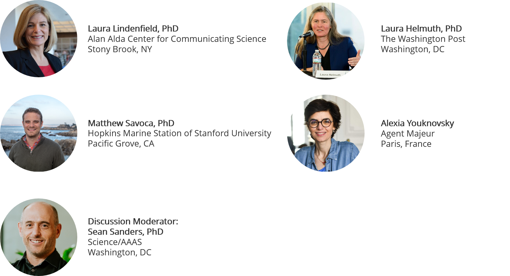

The findings of scientific research are relevant to us all and play a key role in improving our health, preserving our environment, and powering our economic prosperity.  However, science in the media is increasingly overshadowed by provocative headlines about new (and often falsified) findings regarding the most controversial topics such as vaccines, climate change, and genetically modified organisms. In order to restore trust in science and provide clarity in this age of misinformation, scientists need to become more powerful communicators and advocates of their own work. On May 29, 2019, Science/AAAS hosted a webinar discussion that brought together experienced science communicators to offer guidance on best practices for clearly and concisely communicating findings to the research community and the public. Read on for some highlights of the discussion! 

You can watch the entire webinar [here](https://www.sciencemag.org/custom-publishing/webinars/selling-without-selling-out-how-communicate-your-science).

## Panel Experts:

## **Why should we communicate our science?**

* Scientific communication is a fundamental service to your science and to your field. It’s perhaps even more important to share what you’re doing with the public. Properly communicated research findings can inform economic and political policies that affect the lives of all Americans. 
* People who care about evidence are in a battle with the modern-day crisis of misinformation. It’s our mission as scientific communicators to make reality as compelling and viral as the falsified sources of information. 
* Perfectionism is a barrier to scientists communicating their work. We never feel ready to share work that isn't perfect. However, we are always ready because there is great value in receiving feedback at *any stage* of research.

## **How can science effectively be communicated?**

1. Consider your audience 
   
   * Take time to understand your audience and foster a real connection with them.
2. Consider your message 
   
   * Choose **one** clear and concise message, and build everything around it.
3. Consider your delivery
   
   * Storytelling is a powerful method to both convey the importance of your findings and humanize the scientist. 
   
     > *Scientists should use storytelling – stories convey emotion; people remember stories.* 
     >
     > -Alexia Youknovsky

## **How do we talk about science without diminishing the value of the underlying data?**

* Identify your single core message and stick to it. Excessive background information and granular details will distract from the central narrative and may overwhelm your audience. Tell people the most important info and welcome them to learn more.
* Let your excitement shine through. When scientists love communicating their work, it shows and gets the public interested in you and your research. 

## **How do we express confidence in our results while still communicating that no findings can be absolute?**

* Never exaggerate. Speak from a place of authenticity and accuracy at all times.

* Embrace the uncertainty. It's important for people to understand that even when we don't know something for certain, we can still make sound, reasonable, and logical decisions based on the available evidence. 

  > *"For scientists, uncertainty is where the excitement lies..."* 
  > 
  > -Matthew Savoca

## **How can we communicate a controversial topic when the audience might have existing preconceptions about the research?**

* Communication is about trust and listening. Scientists should be curious and reach towards the humanity in every audience they encounter and in every interaction they have. 
* Do not dismiss opinions or discount views that oppose your own.  Open, respectful dialogue with diverse perspectives is beneficial for both parties. Always choose humility over arrogance.
* Spend time researching your audience and understanding their beliefs/opinions.  This will allow you to meet people where they are and invite them into a conversation. 
* Remember, there is no reason to assume every audience is hostile towards science. According to research from [ScienceCounts](https://www.sciencecounts.org/wp-content/uploads/2018/02/ScienceCounts-Aspen-Presentation.pdf), when you say *Science*, the majority of people in the United States feel *hope*.

## **How can scientists to shift their message according to the audience?**

* Remember that most people are genuinely interested in science and want to know what you have to share!
* Keep in mind that we as scientists inherently suffer from the [Curse of Knowledge](https://en.wikipedia.org/wiki/Curse_of_knowledge). We often forget that other people don’t see the world at we do and therefore have trouble communicating our science in ways that will make sense to every audience. 
* Don't dumb the science down. Your audience wants to feel clever and you need to allow them to learn new things. Meet people where they are and guide them to the key findings. We all gain deep satisfaction from putting puzzle pieces together to discover something new.

* If you are engaged in interpersonal conversations with the public:
  * Lead your audience by listening to them.
  * Adjust the jargon and assess their response to determine if they are still engaged.
  * Do they actually get it? Are they asking the right questions? 
  
    > *Empathy is the key. Lead by listening*
    >
    > -Laura Lindenfield

## **How do we speak to audiences who don't see the scientific process as trustworthy?** 

* We need to convey to audiences that they don't have to "believe" or "not believe" in science. Science is a way of thinking - it's about the process of following evidence and accumulating data.
* Science shouldn't be a black box to the public. It's not scary when scientists lead the public at they level they need to by led to understand the scientific process. 
* Scientists need to be involved in communicating their own work to help curb misquoting and misinformation that might fuel groups who are incline to interpret every finding at the extremes. 

## **What role does social media play in scientific communication?**

* Social media allows us to simultaneously build meaningful relationships with the scientific community, journalists, and the public. It's an effective and efficient way to amplify science at a scale that cannot easily be achieved through other channels.

* Scientists' involvement in curating material from reputable sources and promoting research findings on social media helps to compete for people’s attention and pulls their attention away from malicious stories.

  > *Media and science have a signal to noise problem. Scientists should endorse reality and real facts on social media to help cut down on the noise.* 
  >
  > -Laura Helmuth

## **How can scientists develop meaningful relationships with journalists?**

* Keep in mind that journalists operate on a completely different time scale from scientists. They greatly value quick responses. 
* Journalists need to know the key finding right away rather than building up the details to the main point. Respect their time.
* Be a part of the databases designed to help journalists find diverse scientists for quotes and stories.
  * Volunteer to be part of [Sci-line](https://www.sciline.org/for-scientists) and [500 Women Scientists](https://500womenscientists.org/request-a-scientist).
* Journalists live on twitter. It helps them determine emerging topics and interesting people. Scientists should keep an eye on journalists on twitter to learn more about areas they regularly cover and determine who to contact when you'd like to share something with them.
* When you are contacted to comment on other people’s work, please respond even if you don't feel qualified. Reporters just want to understand a little more. Providing context is a real service to help the signal to noise ratio in the media.
* Journalists will often end an interview with the question: "Is there anything I should have asked you that I didn't?" Be prepared for this question, it's an opportunity to share things with them that might not have emerged naturally over the course of the interview.

## **What are some concrete ways scientists can practice taking complex concepts and translating them for public audiences?** 

* Talk with people who are not intimately familiar with your work such as friends, family, a and neighbors.
* Come up with everyday analogies for your science to help people understand and hook their interest. Analogies naturally help invite people into a conversation.
* Look at and learn from kids/youth science media outlets such as [Science News for Students](https://www.sciencenewsforstudents.org/about-us). They offer great examples of widely accessible science stories and visuals.
* Consider joining an improv class or group:
  * Scientists tend to shy away from improv because they associate it with performance and stand-up comedy. However, the central goal of improv training is simply to develop a mindset that values being present and connected to those around you. The environment celebrates making mistakes and getting back to it. Improv helps scientists to understand their audience and give/receive feedback.

## **What resources are available for training in scientific communication?**

* It is widely acknowledged that scientific communication is still not standard in most undergraduate and graduate school curriculums. 
* Spend time gaining exposure to published works created by experienced scientific communicators.  Read their articles/books, listen to their radio shows and podcasts, and watch them give talks. There is a lot to learn about what works from those who have already mastered the art of communicating effectively.
* If you are in a university setting, talk to your university's public information office. They can offer tips and training for interfacing with journalists and also help share your findings through the university's official media channels

Specific online resources that were mentioned:

* [Escaping the Ivory Tower](https://www.amazon.com/Escape-Ivory-Tower-Making-Science/dp/1597266647) 

* The Compass [Message Box](https://www.compassscicomm.org/what-is-the-message-box)

Avenues of formal training are also available:

* The [Alda method](https://www.aldacenter.org/alda-method%C2%AE) - workshops using improvisational techniques to help scientists develop skills in knowing their audience, knowing their goal, knowing their strategy
* [Agent Majeur](https://agentmajeur.com/training/) - workshops, consulting, and training in public speaking and written media to help facilitate better scientific communication.

## **What is one message scientists should take home from this discussion?**

**Laura H:** *You never know who's paying attention - keep communicating. It may echo in the world in ways you may not anticipate.*

**Matt:** *All journalists are wonderfully curious people. Save the names of journalists that talk to you and quote you. Don't be shy - reach out to them!*

**Alexia:** *You can't become a great scientist on your own, you need to build a community.*

**Laura L:** *You are better communicators than you think. People care and will listen.* 

### **TL;DR** ###

Advice to more effectively communicate your science:

* Choose a clear and concise message
* Seek out analogies for your science
* Empathy is the key; Lead by listening
* Respect journalists' time, give them the key finding right away