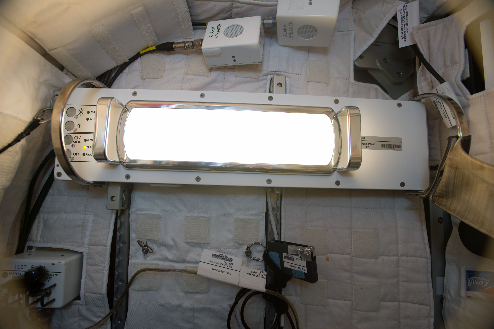
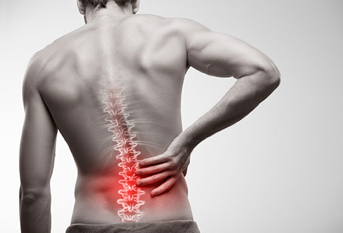
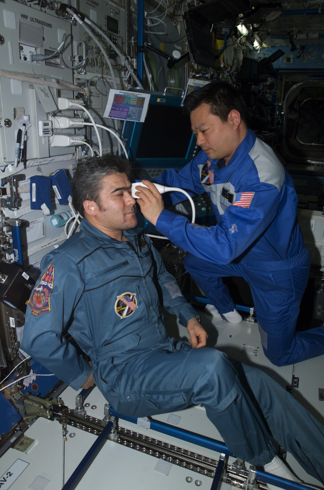

The International Space Station (ISS) has been continuously occupied by human crewmembers for nearly 19 years, serving as a United States national laboratory for hundreds of experiments on everything from sustainable farming to water recycling to foreign microbes.  In particular, there is an entire branch of NASA dedicated to the study of the human body in space with numerous projects attempting to understand the effects of radiation, long-term isolation, and microgravity. This research is certainly compelling and crucial to the success of a future multi-year mission to Mars – but perhaps you didn’t realize that all these high-tech projects also have important implications for our everyday lives here on Earth…

## Indoor lighting that works naturally with your body

*Image source: [NASA](https://www.nasa.gov/sites/default/files/thumbnails/image/iss049e028948.jpg)*

The ISS circles the earth every 90 minutes, which means the astronauts will see sunrise and sunset 16 times each day.  While this makes for some really impressive Instagram pictures, it disrupts the crewmembers’ circadian rhythms and makes consistent, restful sleep difficult. Poor sleep impairs crewmember performance and puts them at risk of dangerous fatigue-related accidents, but researchers at Brigham and Women's Hospital and Thomas Jefferson University might have the solution – [smart LED lights](https://www.nasa.gov/mission_pages/station/research/experiments/explorer/Investigation.html?#id=2013). Specialized LED lights were added to the ISS in 2016, with adjustable intensity and color setting optimized to create a daily rhythm that can shift between general illumination, high performance, and pre-sleep options. Nearly all of us exposed to artificial lighting at work and at home could benefit tremendously from this optimized lighting to promote alertness during the day and sleep in the evenings. In particular, smart LEDs could be especially important for the millions of people who work night shifts at hospitals and factories, helping to create dynamic artificial lighting schedules that mimic the body’s natural rhythms. 

## Models that predict how to build the “dream team”

*Image Source: [NASA](https://www.nasa.gov/sites/default/files/thumbnails/image/jsc2019e030312_copy.jpg)*

NASA has formalized long-term plans to send humans to Mars, a difficult journey that would require years of space travel with limited resources, complete isolation, and delayed communication with Earth.  On top of this, try imagining perhaps the most challenging part of this trip – crewmembers will be traveling in close confinement with several coworkers handpicked not by them, but by their boss. It’ll be crucial that these team members can collaborate effectively and co-exist without causing conflicts that would jeopardize the mission. Researchers at Northwestern University are developing a [computational model](https://lsda.jsc.nasa.gov/Experiment/exper/13722) to optimize the selection of compatible team members by identifying and predicting breakdowns in conflict and communication between people. Currently, the model is being tested on astronauts living in the Human Experimentation Research Analog (HERA) at Houston’s Johnson Space Center, an ISS simulator that houses teams of astronauts for months at a time to simulate task performance and team dynamics on long missions. When completed, this computational model of team functionality and social compatibility could be instrumental in forming better teams in our own workplaces and athletic teams. The ability to proactively form cohesive teams and predict interpersonal tensions would increase collective productivity and improve overall satisfaction.

## Unlocking the mystery of lower back pain

*Image Source: [EmedicineHealth](https://images.emedicinehealth.com/images/slideshow/emss-topper/low-back-pain.jpg)*

Long-duration exposure to microgravity degrades the bone and muscle strength of astronauts, leading to back pain on mission that can persist for sometimes years after their return to earth. To help combat this, astronauts perform a wide variety of resistance and aerobic exercises on specialized onboard ISS training equipment. Nevertheless, the long term back pain still persists. Researchers at Harvard are using biomedical imaging of astronauts spines before and after spaceflight to study specific changes in the [spinal muscle](https://journals.lww.com/spinejournal/Abstract/publishahead/Negative_Effects_of_Long_Duration_Spaceflight_on.94757.aspx) and to understand more about the source of this pain. Across studies they’ve found an infiltration of fat tissue in the lumbar muscles that support spine stability and posture, a phenomenon which has also been seen in patients with chronic back pain. This change decreases the muscle quality and irritates the surrounding nerves, possibly contributing to the pain experienced by both astronauts and people here on earth. This research is currently being used by NASA engineers and exercise physiologists to design better [exercise equipment](https://sonic.northwestern.edu/projects-2/crews/) that targets the strength of deep spinal muscles and reduces fat infiltration into muscles. This technology could eventually be adapted for use in physical therapy programs to potentially offer targeted relief to the millions of people who suffer from back pain. 

## Versatile medical devices for low resource environments

*Image Source: [NASA](https://www.nasa.gov/sites/default/files/thumbnails/image/adum6.jpg)* 

Efficient medical care is key for survival when health emergencies occur. For most people in this day and age, an ambulance ride can get them to medical center with advanced imaging and diagnostic facilities. However, up on the ISS, this is not a luxury that astronauts have – there simply isn’t enough room or available power on the Space Station to support large biomedical equipment (MRI, CT, X-ray). To address this, researchers at Henry Ford Hospital have developed specialized training protocols to use small [handheld ultrasound devices](https://www.nasa.gov/mission_pages/station/research/experiments/944.html) to perform a wide variety of diagnostics on internal organs that usually would require several imaging systems. This process is unique as it doesn’t require the astronauts to have the years of specialized training to interpret the ultrasound results. Instead, they transmit all the images back down to earth, where they can be analyzed by expert physicians. This combination of a small compact imaging device and telehealth information transmission has important implications for people in rural, low-resource areas without access to medical centers.  The technology would allow clinicians with minimal training in ultrasound to perform an exam on a sick patient with help from an expert at hospitals hundreds or thousands of miles away, thereby drastically improving the treatment capabilities of underserved communities and disaster areas. 

As you can now appreciate, research on the space station enables important advances in human health and technology that can improve quality of life for all of us back on Earth. To learn more about how NASA research benefits humanity, check out this [NASA page](https://www.nasa.gov/mission_pages/station/research/benefits/human-health).