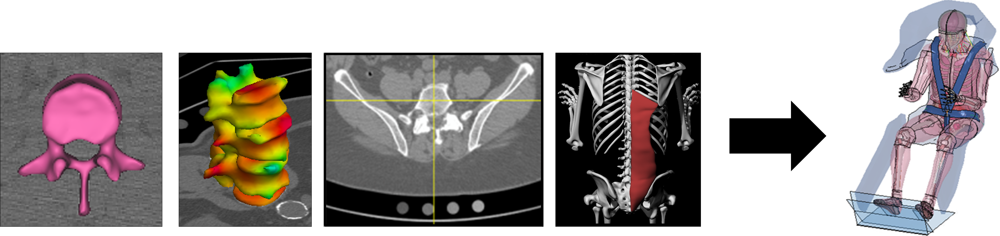

## **Long-Term Effects of Weight Loss and Supplemental Protein on Older Adult Bone Health**
### (PhD Research Project: 2017-2022)

Despite remarkable improvements in physiological and cardiometabolic indices, mounting evidence suggests weight loss increases skeletal fragility and fracture risk in older populations. This clinical research uses noninvasive computational biomechanics tools to comprehensively assess bone health and predict fracture in obese older adults who undergo a weight-loss intervention involving caloric restriction, supervised exercise, and randomization to receive either a high protein or low protein diet. The results of this study could establish the plausibility of protein supplementation as a clinically relevant therapeutic for attenuating bone loss and mitigating fracture risk in older adults undergoing intentional weight loss. 

My graduate research focuses on developing image analysis and finite element modeling tools to process the imaging data from the above project. I am supported by an NIH Ruth L. Kirschstein Predoctoral Fellowship (NRSA F31) from the National Institute on Aging.

This research is supported by NIH F31-AG069414, NIH K25-AG058804, and NIH R01-AG050656. 

Graduate Advisor: [Ashley Weaver, PhD](https://school.wakehealth.edu/Faculty/W/Ashley-Anne-Weaver)

## **Vertebral Strength and Injury Risk Following Spaceflight**
### (Master's Research Project: 2017-2020)

Prolonged periods of microgravity exposure can damage astronauts’ musculoskeletal system, increasing their risk of vertebral injuries including fracture. A portion of this research focuses on measuring the degradation of astronauts’ vertebrae and spinal muscles during missions aboard the International Space Station (ISS). We use this data to create human body computational models that simulate crewmember injury risk in the spine during spacecraft launch and landing. 

This research is supported by NASA NNX16AP89G.

Graduate Advisor: [Ashley Weaver, PhD](https://school.wakehealth.edu/Faculty/W/Ashley-Anne-Weaver)

Learn more about the project [here](https://www.nasa.gov/mission_pages/station/research/experiments/explorer/Investigation.html?#id=7540) 

### Publications from this project: 
Trunk Skeletal Muscle Changes on CT with Long-Duration Spaceflight.  
**Greene KA**, Withers SS, Lenchik L, Tooze JA, Weaver AA.  
*Annals of Biomedical Engineering*. February 21, 2021.
https://link.springer.com/article/10.1007/s10439-021-02745-8

Neck Muscle Changes Following Long-Duration Spaceflight.  
McNamara KP, **Greene KA**, Tooze JA, Dang J, Khattab K, Lenchik L, Weaver AA.  
*Frontiers in Physiology*. September 13, 2019.
https://www.frontiersin.org/articles/10.3389/fphys.2019.01115/full

Lumbopelvic Muscle Changes Following Long-Duration Spaceflight.  
McNamara KP, **Greene KA**, Moore AM, Lenchik L, Weaver AA.  
*Frontiers in Physiology*. May 21, 2019.
https://www.frontiersin.org/articles/10.3389/fphys.2019.00627/full